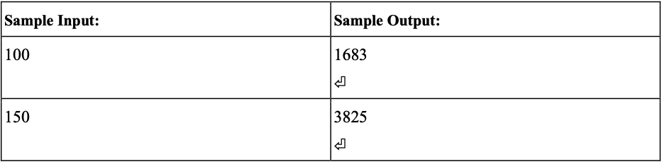

# 2021-10-18-程式設計 (I)實習課題目

## 第 1 題: 計算正整數被 3 整除之數值之總和

---

### 問題描述:

試寫一個程式，輸入一正整數 N，可計算出 1 到 N 之間可被 3 整除的數值之總和。

### 輸入說明:

輸入一正整數。

### 輸出說明:

輸出總和，最後必須有換行字元。

### 範例:

## 第 2 題: $n \times n$ 乘法表

---

### 問題描述:

輸出 n×n 乘法表。

### 輸入說明:

輸入一正整數 n。

### 輸出說明:

輸出 $n\times n$ 乘法表$(0 \lt n \leq 9)$，每個輸出數字皆以 tab 間格，最後必須有換行字元。

### 範例:

%E5%AF%A6%E7%BF%92%E8%AA%B2%E9%A1%8C%E7%9B%AE%203b63a64159de4bb9a31944861e012890/Screen_Shot_2021-10-17_at_12.06.14_AM.png)

## 第 3 題: 正因數

---

### 問題描述:

讓使用者輸入一正整數 $n$，輸出 $n$ 的所有正因數。

### 輸入說明:

輸入一正整數 $n$。

### 輸出說明:

輸出 $n$ 的所有正因數，最後必須有換行字元。

### 範例:

%E5%AF%A6%E7%BF%92%E8%AA%B2%E9%A1%8C%E7%9B%AE%203b63a64159de4bb9a31944861e012890/Screen_Shot_2021-10-17_at_12.11.22_AM.png)

## 第 4 題: $n$ 階層

---

### 問題描述:

讓使用者輸入一正整數 n，用 while 迴圈計算 n! 後輸出。

Tips: 階層計算結果可能會很大所以要用 unsigned long long int 來宣告變數

### 輸入說明:

輸入一正整數 n。

### 輸出說明:

以 while 迴圈計算 n! 後輸出，最後必須有換行字元。

### 範例:

%E5%AF%A6%E7%BF%92%E8%AA%B2%E9%A1%8C%E7%9B%AE%203b63a64159de4bb9a31944861e012890/Screen_Shot_2021-10-17_at_12.18.27_AM.png)

## 第 5 題: $n\times (n+1)$ 總合

---

### 問題描述:

讓使用者輸入一正整數 $n$，計算 $1\times (1+1) + 2\times (2+1) + 3\times (3+1) + ... + n\times (n+1)$ 並輸出結果。

### 輸入說明:

輸入一正整數 n。

### 輸出說明:

計算$1\times (1+1) + 2\times (2+1) + 3\times (3+1) + ... + n\times (n+1)$並輸出結果，最後必須有換行字元。

### 範例:

%E5%AF%A6%E7%BF%92%E8%AA%B2%E9%A1%8C%E7%9B%AE%203b63a64159de4bb9a31944861e012890/Screen_Shot_2021-10-17_at_12.26.40_AM.png)

## 第 6 題: $\frac{1}{(2n-1)\times(2n)}$ 總和

---

### 問題描述:

讓使用者輸入一正整數 $n$，計算 $1/(1*2)+1/(3*4)+1/(5*6)+...+1/[(2n-1)*(2n)]$並輸出結果。

### 輸入說明:

輸入一正整數 $n$。

### 輸出說明:

計算 $1/(1*2)+1/(3*4)+1/(5*6)+...+1/[(2n-1)*(2n)]$並輸出結果(double)，小數點後 16 位，最後必須有換行字元。

### 範例:

%E5%AF%A6%E7%BF%92%E8%AA%B2%E9%A1%8C%E7%9B%AE%203b63a64159de4bb9a31944861e012890/Screen_Shot_2021-10-17_at_12.31.45_AM.png)

## 第 7 題: 質數判別

---

### 問題描述:

試用 while 迴圈撰寫一個程式，判斷使用者輸入的一個正整數否為質數。質數是指除了 1 和它本身之外，沒有其它的數可以整除它的數，例如:2,3,5,7 與 11 等皆為質數。

### 輸入說明:

輸入一個正整數。

### 輸出說明:

質數顯示 YES;非質數顯示 NO，最後必須有換行字元。

### 範例:

%E5%AF%A6%E7%BF%92%E8%AA%B2%E9%A1%8C%E7%9B%AE%203b63a64159de4bb9a31944861e012890/Screen_Shot_2021-10-16_at_11.34.25_PM.png)

## 第 8 題: 數字串和

---

### 問題描述:

讓使用者輸入一正整數 n，使用 while 迴圈判斷並輸出該整數為幾位數與每一位數之總和。

例如:輸入 12345，輸出為 15 (1+2+3+4+5=15)

### 輸入說明:

輸入一正整數 n。

### 輸出說明:

判斷並輸出該整數為幾位數與各位數之和，最後必須有換行字元

### 範例:

%E5%AF%A6%E7%BF%92%E8%AA%B2%E9%A1%8C%E7%9B%AE%203b63a64159de4bb9a31944861e012890/Screen_Shot_2021-10-17_at_12.44.42_AM.png)

## 第 9 題: 最大公因數與最小公倍數

---

### 問題描述:

請用 while 迴圈並使用「輾轉相除法」計算使用者輸入的二個正整數，求其最大公因數與最小公倍數

### 輸入說明:

給定二個正整數。

### 輸出說明:

輸出最大公因數與最小公倍數，最後必須有換行字元。

### 範例:

%E5%AF%A6%E7%BF%92%E8%AA%B2%E9%A1%8C%E7%9B%AE%203b63a64159de4bb9a31944861e012890/Screen_Shot_2021-10-16_at_11.50.06_PM.png)

## 第 10 題: 十進制轉二進制

---

### 問題描述:

撰寫一個程式，使用者輸入一個非負整數，印出其 8 位元的二進制表示。

### 輸入說明:

輸入一個非負整數，介於 0~255 之間。

### 輸出說明:

以 8 位元的二進制表示，最後必須有換行字元。

### 範例:

%E5%AF%A6%E7%BF%92%E8%AA%B2%E9%A1%8C%E7%9B%AE%203b63a64159de4bb9a31944861e012890/Screen_Shot_2021-10-16_at_4.09.15_PM.png)
